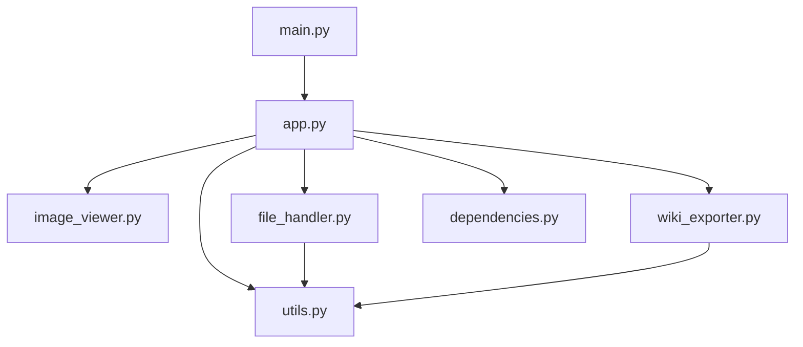

# 模块化架构设计

根据对 `grok_1.py` 文件的分析，我们将应用程序拆分为以下模块，以提高可维护性和代码组织性：

## 1. `main.py`

*   **职责:** 应用程序的入口点，负责初始化 `SpreadsheetApp` 并运行主循环。
*   **依赖:** `app.py`。

## 2. `app.py`

*   **类:** `SpreadsheetApp`
*   **职责:** 核心应用程序逻辑，负责创建主窗口、工具栏、表格和状态栏，并协调各个功能模块。
*   **依赖:** `image_viewer.py`, `file_handler.py`, `wiki_exporter.py`, `utils.py`。

## 3. `image_viewer.py`

*   **类:** `ImageViewerWindow`
*   **职责:** 独立处理图片查看器窗口的逻辑和UI。
*   **依赖:** `PIL` (Pillow) 库。

## 4. `file_handler.py`

*   **类:** `FileHandler`
*   **职责:** 封装所有与文件操作相关的逻辑，包括打开/保存Excel文件、导入/导出完整包、处理图片资产等。
*   **依赖:** `pandas`, `xlsxwriter`, `openpyxl`, `shutil`, `os`, `zipfile`, `datetime`, `re`。

## 5. `wiki_exporter.py`

*   **类:** `WikiExporter`
*   **职责:** 封装所有与Confluence Wiki导出相关的逻辑，包括生成Wiki内容、复制到剪贴板等。
*   **依赖:** `re`。

## 6. `utils.py`

*   **职责:** 存放通用的辅助函数，例如生成Excel列标题、图片路径提取、文本清理等。
*   **依赖:** 无特定外部依赖，可能依赖 `os`, `re`。

## 7. `dependencies.py`

*   **职责:** 集中管理所有外部库的导入和可用性检查，避免在每个文件中重复检查。
*   **依赖:** `tkinter`, `tksheet`, `PIL`, `pandas`, `xlsxwriter`, `openpyxl`。

## 模块间关系图

## 拆分步骤概述

1.  创建新的文件：`main.py`, `app.py`, `image_viewer.py`, `file_handler.py`, `wiki_exporter.py`, `utils.py`, `dependencies.py`。
2.  将 `grok_1.py` 中的 `ImageViewerWindow` 类移动到 `image_viewer.py`。
3.  将 `grok_1.py` 中的 `SpreadsheetApp` 类的主体逻辑移动到 `app.py`。
4.  将所有文件操作相关的函数（`save_excel_file`, `open_excel_file`, `import_package`, `export_package` 等）及其辅助函数移动到 `file_handler.py`。
5.  将所有Wiki导出相关的函数（`export_to_wiki`, `get_wiki_content`, `copy_wiki_to_clipboard` 等）及其辅助函数移动到 `wiki_exporter.py`。
6.  将通用的辅助函数（`generate_column_headers`, `extract_image_paths`, `clean_text_content`, `format_cell_with_images`, `copy_images_to_assets`, `add_images_to_cell_incremental`, `auto_adjust_row_heights` 等）移动到 `utils.py`。
7.  将依赖检查和导入逻辑移动到 `dependencies.py`。
8.  更新各个模块中的导入语句，确保它们能够正确引用其他模块中的类和函数。
9.  在每个文件和关键函数中添加详细的注释。
10. 进行测试以确保所有功能正常工作。

